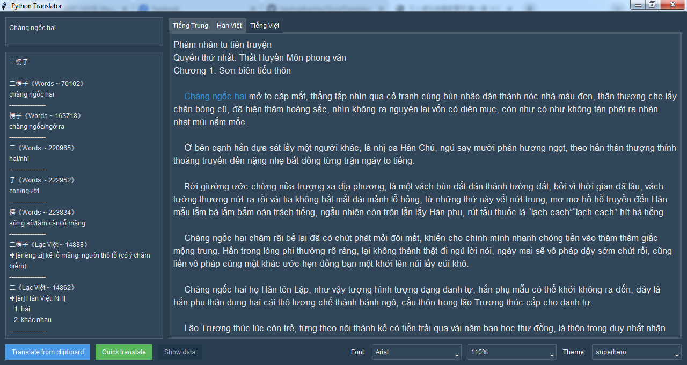

# Python Translator

Python Translator is a simple GUI tool built in Python to translate text from Chinese to Vietnamese, with functions referenced from Quick Translator.

## GUI Translator (Chinese to Vietnamese)

This is a graphical user interface (GUI) translator application that translates text from Chinese to Vietnamese.

## Requirements

- Python 3.8.10
- tkinter (Python's built-in GUI framework)
- pyperclip 1.8.2
- ttkbootstrap 1.10.1
- Best resolution is 1280x720 (or you have to manually adjust the size of the widgets)

## Installation

1. Clone the repository:
   git clone https://github.com/baohoathanhto/python-translator.git

2. Navigate to the project directory:
   cd python-translator

3. Install the required dependencies:
   pip install -r requirements.txt

## Usage

To use the GUI translator, run the following command:
   python translator_ui.py

1. Copy the text you want to translate from any sources (Word, Notepad, Browser,...).
2. Click the "Translate from clipboard" button.
3. The translated text will be displayed in Vietnamese tab.

## Other Usage

1. After "Translate from clipboard", you can click the "Quick translate" button to translate the Chinese text after editing, this function only takes effect after using "Translate from clipboard", it helps Speed up the editing and translation process.
2. You can use "batch_copy_rename_ui.py" to automatically copy all the necessary files from Quick Translator to the project's "data" directory.

## Screenshot

## Contributing

Contributions are welcome! Please open an issue to discuss the changes or submit a pull request.

## License

This project is licensed under the MIT License. See the LICENSE file for details.
